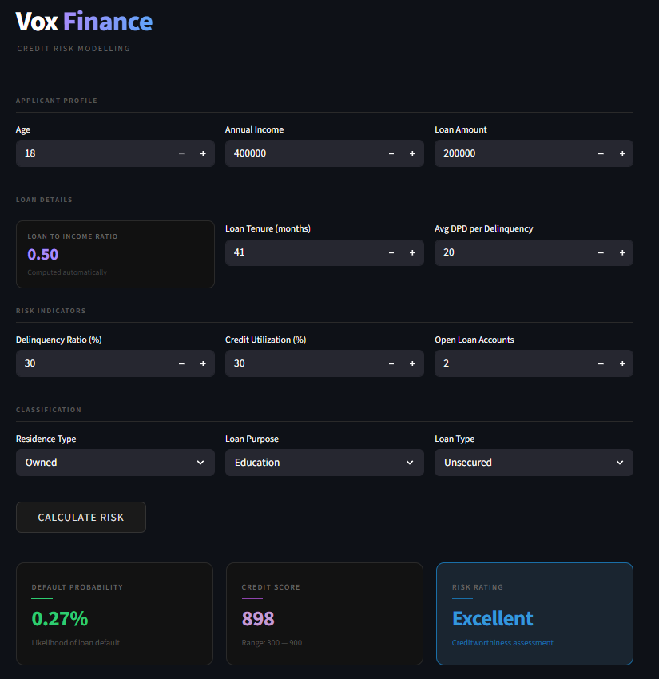
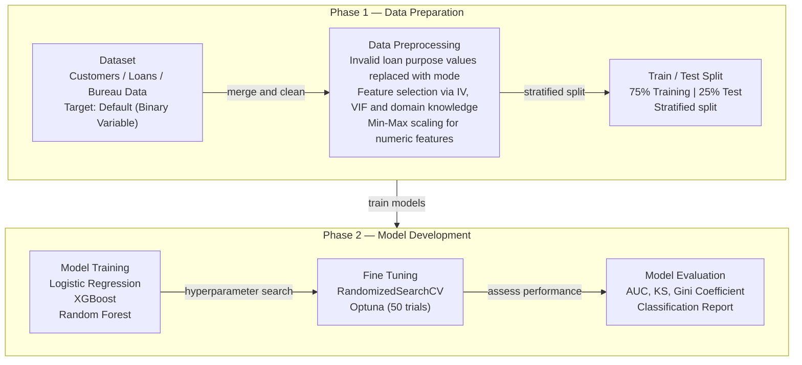

# Vox Finance — Credit Risk Modelling



> An end-to-end machine learning system for quantifying borrower default risk, generating credit scores, and delivering real-time risk ratings through an interactive web application.

**Live App:** [https://vox-credit-risk-modelling.streamlit.app/](https://vox-credit-risk-modelling.streamlit.app/)

---

## Table of Contents

1. [Project Overview](#project-overview)
2. [Business Context](#business-context)
3. [Dataset Architecture](#dataset-architecture)
4. [Project Structure](#project-structure)
5. [Machine Learning Pipeline](#machine-learning-pipeline)
   - [Data Ingestion & Merging](#1-data-ingestion--merging)
   - [Data Cleaning](#2-data-cleaning)
   - [Exploratory Data Analysis](#3-exploratory-data-analysis)
   - [Feature Engineering](#4-feature-engineering)
   - [Feature Selection](#5-feature-selection)
   - [Model Training & Attempts](#6-model-training--attempts)
   - [Model Evaluation](#7-model-evaluation)
   - [Credit Score Calculation](#8-credit-score-calculation)
6. [Model Performance Summary](#model-performance-summary)
7. [Web Application](#web-application)
8. [Tech Stack](#tech-stack)
9. [Inference Flow](#inference-flow)

---

## Project Overview

Vox Finance's Credit Risk Modelling system predicts the **probability of loan default** for individual borrowers and translates that probability into a human-readable **credit score (300–900)** and a **risk rating** (Poor / Average / Good / Excellent). The system is built on a Logistic Regression model trained with SMOTE-Tomek resampling and hyperparameter-tuned via Optuna, then deployed as a Streamlit web application.

---

## Business Context

Lending institutions lose substantial capital to loan defaults every year. Accurately predicting default risk at the time of loan application allows a lender to:

- **Price risk appropriately** — adjust interest rates based on borrower risk profile
- **Set credit limits** — restrict exposure to high-risk borrowers
- **Automate decisions** — reduce manual credit review overhead
- **Maintain portfolio health** — monitor aggregate risk across the loan book

The model directly outputs three actionable signals:

| Output | Description | Range |
|---|---|---|
| Default Probability | Likelihood the borrower will default | 0% – 100% |
| Credit Score | Calibrated risk score derived from log-odds | 300 – 900 |
| Risk Rating | Human-readable creditworthiness label | Poor / Average / Good / Excellent |

---

### Modelling Steps



---

## Dataset Architecture

The system uses **three raw CSV datasets**, each with **50,000 records**, merged on `cust_id`.

### customers.csv — Applicant Demographics

| Column | Type | Description |
|---|---|---|
| `cust_id` | string | Unique customer identifier |
| `age` | int | Applicant age in years |
| `gender` | string | Gender of the applicant |
| `marital_status` | string | Marital status |
| `employment_status` | string | Employment type (Salaried / Self-employed / etc.) |
| `income` | float | Annual income in INR |
| `number_of_dependants` | int | Number of financial dependants |
| `residence_type` | string | Owned / Rented / Mortgage |
| `years_at_current_address` | float | Residential stability indicator |
| `city` | string | City of residence |
| `state` | string | State of residence |
| `zipcode` | string | Postal code |

**Shape:** 50,000 rows × 12 columns

---

### loans.csv — Loan Transaction Details

| Column | Type | Description |
|---|---|---|
| `loan_id` | string | Unique loan identifier |
| `cust_id` | string | Foreign key to customers |
| `loan_purpose` | string | Education / Home / Auto / Personal |
| `loan_type` | string | Secured / Unsecured |
| `sanction_amount` | float | Amount sanctioned by the lender |
| `loan_amount` | float | Actual disbursed amount |
| `processing_fee` | float | Fee charged on loan processing |
| `gst` | float | GST applied on processing fee |
| `net_disbursement` | float | Amount received by the borrower |
| `loan_tenure_months` | int | Loan repayment period in months |
| `principal_outstanding` | float | POS (Principal Outstanding) / Book Size of Customer |
| `bank_balance_at_application` | float | Applicant's bank balance at time of application |
| `disbursal_date` | date | Date of loan disbursement |
| `installment_start_dt` | date | Date repayments commenced |
| `default` | bool | **Target variable** — whether the borrower defaulted |

**Shape:** 50,000 rows × 15 columns  
**Class Distribution:**

| Class | Count | Percentage |
|---|---|---|
| Non-Default (0) | 45,703 | ~91.4% |
| Default (1) | 4,297 | ~8.6% |

> The dataset has a significant **class imbalance** (~10:1 ratio), which was addressed during model training.

---

### bureau_data.csv — Credit Bureau History

| Column | Type | Description |
|---|---|---|
| `cust_id` | string | Customer ID |
| `number_of_open_accounts` | int | Total number of open accounts till date |
| `number_of_closed_accounts` | int | Total number of closed accounts till date |
| `total_loan_months` | int | Total loan duration in months |
| `delinquent_months` | int | Total months with missed payments |
| `total_dpd` | int | Total Days Past Due across all loans |
| `enquiry_count` | int | Total credit enquiry count |
| `credit_utilization_ratio` | float | Credit utilization ratio (% of available credit used) |

**Shape:** 50,000 rows × 8 columns

---

## Project Structure

```
1.ML Project Credit Risk Modelling/
│
├── dataset/
│   ├── customers.csv          # Applicant demographic data (50K rows)
│   ├── loans.csv              # Loan transaction & target data (50K rows)
│   └── bureau_data.csv        # Credit bureau history (50K rows)
│
├── models/
│   └── model_data.joblib      # Serialized model bundle:
│                              #   - Trained LogisticRegression model
│                              #   - Fitted MinMaxScaler
│                              #   - Selected feature list
│                              #   - Columns to scale
│
├── notebooks/
│   └── Credit Risk Model.ipynb  # Full ML pipeline: EDA → Training → Evaluation
│
├── app/
│   ├── main.py                # Streamlit application UI
│   └── prediction_helper.py   # Inference logic & credit score computation
│
└── README.md
```

---

## Machine Learning Pipeline

### 1. Data Ingestion & Merging

All three datasets are loaded and merged into a single analytical dataframe:

```
customers.csv  ──┐
                  ├── merge on cust_id ──> df  ──┐
loans.csv      ──┘                               ├──> merge on cust_id ──> df1 (50K × 34)
bureau_data.csv ─────────────────────────────────┘
```

The merged dataset contains **34 columns** across demographics, loan attributes, bureau history, and the target variable `default`.

---

### 2. Data Cleaning

| Issue | Resolution |
|---|---|
| Null values in `residence_type` | Imputed with training set **mode** |
| Duplicate records | Verified none present in training set |
| Outlier `processing_fee` values | Rows where `processing_fee / loan_amount > 3%` were removed as erroneous |
| Misspelled category `"Personaal"` in `loan_purpose` | Corrected to `"Personal"` in both train and test sets |

A **train/test split of 75/25** was applied with `stratify=y` to preserve class proportions.

---

### 3. Exploratory Data Analysis

Continuous distributions were analyzed using KDE plots segmented by `default=0` and `default=1`:

**Key EDA Insights:**

| Feature | Observation |
|---|---|
| `age` | Younger applicants skew towards higher default rates — the default=1 KDE is shifted left |
| `loan_tenure_months` | Longer tenures correlate with higher default probability |
| `delinquent_months` | Strong separation — defaulters have significantly more delinquent months |
| `total_dpd` | High DPD values are strongly associated with defaults |
| `credit_utilization_ratio` | Higher utilization ratio associated with higher default risk |
| `loan_amount` / `income` | Individually weak predictors; combined as Loan-to-Income ratio they become meaningful |

Correlation and distribution analyses confirmed that raw `loan_amount` and `income` are individually poor predictors but their **ratio** is highly informative.

---

### 4. Feature Engineering

Three derived features were constructed to capture non-linear risk signals:

| Engineered Feature | Formula | Rationale |
|---|---|---|
| `loan_to_income` | `loan_amount / income` | Measures borrower leverage — higher ratio = higher stress |
| `delinquency_ratio` | `(delinquent_months / total_loan_months) × 100` | % of loan life spent in missed payments — standardises across loan lengths |
| `avg_dpd_per_delinquency` | `total_dpd / delinquent_months` | Average severity of each delinquency event, 0 for non-delinquent |

KDE plots confirmed all three engineered features show **clear separation** between default and non-default classes.

---

### 5. Feature Selection

Two rigorous statistical methods were used to select the final feature set:

#### Variance Inflation Factor (VIF) — Multicollinearity Removal

VIF analysis identified highly collinear features. The following were removed:

```
sanction_amount, processing_fee, gst, net_disbursement, principal_outstanding
```

These variables carry redundant information relative to `loan_amount` and `net_disbursement`.

#### Information Value (IV) — Predictive Power Ranking

IV quantifies how well each feature discriminates between defaulters and non-defaulters:

| IV Range | Predictive Power |
|---|---|
| < 0.02 | Unpredictive |
| 0.02 – 0.1 | Weak |
| 0.1 – 0.3 | Medium |
| > 0.3 | Strong |

**Significant Variables (IV scores):**

| Variable | IV | Inference |
|---|---|---|
| `credit_utilization_ratio` | 2.35 | Higher usage of available credit significantly increases default risk |
| `delinquency_ratio` | 0.71 | Higher delinquency rates are strongly linked to increased default risk |
| `loan_to_income` | 0.47 | Higher loan amounts relative to income increase the likelihood of default |
| `avg_dpd_per_delinquency` | 0.40 | Higher days past due per delinquency correlates with higher default risk |
| `loan_purpose` | 0.36 | Certain loan purposes are more likely to be associated with default |
| `residence_type` | 0.24 | Residence type has a moderate impact on default risk |
| `loan_tenure_months` | 0.21 | Longer loan tenures increase default risk |
| `loan_type` | 0.16 | Different loan types have a minor influence on default risk |
| `age` | 0.08 | Younger or older age has a minimal effect on default risk |
| `number_of_open_accounts` | 0.08 | More open accounts can lead to default risk |

Features with `IV > 0.02` were retained. This threshold eliminated low-signal variables and produced a lean, interpretable feature set.

Categorical features were one-hot encoded with `drop_first=True` to avoid the dummy variable trap.

---

### 6. Model Training & Attempts

Three training strategies were explored, each progressively improving handling of class imbalance:

#### Attempt 1 — Baseline (No Imbalance Handling)

Three algorithms were trained on the raw imbalanced data:

| Model | Notes |
|---|---|
| Logistic Regression | Baseline linear model |
| Random Forest | Ensemble tree-based model |
| XGBoost | Gradient boosted tree model |

Hyperparameter tuning via **RandomizedSearchCV** was applied to both Logistic Regression and XGBoost.  
Result: Models were biased toward the majority class — poor recall on defaulters.

---

#### Attempt 2 — Random Under-Sampling

The majority class (non-defaulters) was down-sampled using `RandomUnderSampler` to achieve a balanced class distribution.

| Model | Notes |
|---|---|
| Logistic Regression | Improved minority class recall |
| XGBoost | Applied best params from Attempt 1 |

---

#### Attempt 3 — SMOTETomek + Optuna (Final Approach)

**SMOTETomek** was used for combined over-sampling (SMOTE on minority) and under-sampling (Tomek links removal) — preserving informative boundary samples.

Hyperparameter optimisation was performed using **Optuna** (Bayesian optimisation) with 50 trials optimising macro F1-score across 3-fold cross-validation:

**Final Logistic Regression Parameters (Optuna-tuned):**

```
C              : (optimised via log-uniform search: 1e-4 to 1e4)
solver         : (from: lbfgs, liblinear, saga, newton-cg)
tol            : (log-uniform: 1e-6 to 1e-1)
class_weight   : balanced
max_iter       : 10,000
```

This was selected as the **final production model**.

---

### 7. Model Evaluation

#### Classification Report

The final Logistic Regression with SMOTETomek achieved meaningful recall on the minority (default) class while maintaining reasonable precision on the majority class.

#### ROC Curve & AUC

```
AUC Score:         ~0.98 (area under ROC curve)
Gini Coefficient:  2 × AUC − 1  ≈  0.96
```

A high AUC indicates strong rank-ordering capability — the model effectively separates high-risk from low-risk borrowers.

#### KS Statistic (Kolmogorov-Smirnov)

The KS statistic measures maximum separation between the cumulative distribution of defaulters and non-defaulters across deciles. **Maximum KS of 85.988** is achieved at Decile 8 (highlighted), confirming excellent rank ordering:

| Decile | Min Prob | Max Prob | Events | Non-events | Event Rate | Non-event Rate | Cum Events | Cum Non-events | Cum Event Rate | Cum Non-event Rate | KS |
|---|---|---|---|---|---|---|---|---|---|---|---|
| 9 | 0.812 | 1.000 | 900 | 350 | 72.000 | 28.000 | 900 | 350 | 83.799 | 3.064 | 80.735 |
| **8** | **0.198** | **0.812** | **159** | **1091** | **12.720** | **87.280** | **1059** | **1441** | **98.603** | **12.615** | **85.988** |
| 7 | 0.026 | 0.198 | 10 | 1239 | 0.801 | 99.199 | 1069 | 2680 | 99.534 | 23.461 | 76.073 |
| 6 | 0.004 | 0.026 | 5 | 1245 | 0.400 | 99.600 | 1074 | 3925 | 100.000 | 34.361 | 65.639 |
| 5 | 0.001 | 0.004 | 0 | 1249 | 0.000 | 100.000 | 1074 | 5174 | 100.000 | 45.295 | 54.705 |
| 4 | 0.000 | 0.001 | 0 | 1250 | 0.000 | 100.000 | 1074 | 6424 | 100.000 | 56.237 | 43.763 |
| 3 | 0.000 | 0.000 | 0 | 1250 | 0.000 | 100.000 | 1074 | 7674 | 100.000 | 67.180 | 32.820 |
| 2 | 0.000 | 0.000 | 0 | 1249 | 0.000 | 100.000 | 1074 | 8923 | 100.000 | 78.114 | 21.886 |
| 1 | 0.000 | 0.000 | 0 | 1250 | 0.000 | 100.000 | 1074 | 10173 | 100.000 | 89.057 | 10.943 |
| 0 | 0.000 | 0.000 | 0 | 1250 | 0.000 | 100.000 | 1074 | 11423 | 100.000 | 100.000 | 0.000 |

**Top 3 Decile Capture Rate: 99.53%** — nearly all defaults are captured by scoring the top 3 risk deciles.

#### Feature Importance (Logistic Regression Coefficients)

The most influential features by coefficient magnitude, in order of predictive impact:

| Feature | Direction | Interpretation |
|---|---|---|
| `avg_dpd_per_delinquency` | + | Higher average days past due → higher default risk |
| `delinquency_ratio` | + | Greater % of delinquent months → higher risk |
| `credit_utilization_ratio` | + | Over-extended credit → higher risk |
| `loan_to_income` | + | Higher leverage → higher risk |
| `loan_tenure_months` | + | Longer tenure → higher risk |
| `age` | − | Older applicants → lower risk |
| `number_of_open_accounts` | ± | Context-dependent |
| `loan_type_Unsecured` | + | Unsecured loans carry more risk |

---

### 8. Credit Score Calculation

The credit score is derived from the model's raw log-odds output — a standard practise in lendingscorecard design:

$$
\text{Credit Score} = 300 + 600 \times \log\!\left(\frac{P(\text{non-default})}{P(\text{default})}\right)
$$

| Credit Score | Risk Rating |
|---|---|
| 300 – 499 | Poor |
| 500 – 549 | Average |
| 650 – 749 | Good |
| 750 – 900 | Excellent |

This log-odds transformation ensures the score is **monotonically decreasing with default probability** and maps naturally to the industry-standard 300–900 credit score range.

---

## Model Performance Summary

### Trials and Performance

| Model | AUC | Gini |
|---|---|---|
| **Logistic Regression** *(selected)* | **98%** | **96%** |
| XGBoost | 99% | 96% |
| Random Forest | 97% | 95% |

Logistic Regression was selected as the final production model for its **interpretability**, scorecard compatibility, and near-equivalent performance to XGBoost.

### Final Model Metrics

| Metric | Value |
|---|---|
| Algorithm | Logistic Regression |
| Resampling | SMOTETomek |
| Hyperparameter Tuning | Optuna (50 trials, 3-fold CV) |
| AUC | 98% |
| Gini Coefficient | 96% |
| Max KS Statistic | 85.988 (Decile 8) |
| Top 3 Decile Capture Rate | 99.53% |
| Score Range | 300 – 900 |
| Training Set Size | 75% of 50,000 records |
| Test Set Size | 25% of 50,000 records |

---

## Web Application

Built with **Streamlit**, the application provides a real-time credit risk assessment interface.

### Input Sections

| Section | Fields |
|---|---|
| **Applicant Profile** | Age, Annual Income, Loan Amount |
| **Loan Details** | Loan-to-Income Ratio (auto-computed), Loan Tenure, Avg DPD |
| **Risk Indicators** | Delinquency Ratio, Credit Utilization, Open Accounts |
| **Classification** | Residence Type, Loan Purpose, Loan Type |

### Output Panel

After clicking **Calculate Risk**, three metric cards are rendered:

| Card | Content | Color Logic |
|---|---|---|
| Default Probability | % likelihood of default | Red (≥ 50%) / Green (< 50%) |
| Credit Score | Numeric score 300–900 | Purple accent |
| Risk Rating | Poor / Average / Good / Excellent | Red / Orange / Green / Blue |

---

## Tech Stack

| Category | Technology |
|---|---|
| Language | Python 3.14 |
| Data Processing | pandas, numpy |
| Visualisation | matplotlib, seaborn |
| Machine Learning | scikit-learn |
| Gradient Boosting | XGBoost |
| Imbalance Handling | imbalanced-learn (SMOTETomek, RandomUnderSampler) |
| Hyperparameter Tuning | Optuna |
| Statistical Analysis | statsmodels (VIF) |
| Model Serialisation | joblib |
| Web Application | Streamlit |
| Environment | Python venv |

---

## Inference Flow

```
User Input (Streamlit UI)
        │
        ▼
prediction_helper.prepare_df()
  - Constructs feature DataFrame
  - Applies MinMaxScaler to numeric columns
  - Selects model feature columns
        │
        ▼
prediction_helper.calculate_credit_risk()
  - Computes log-odds: X·coef + intercept
  - Derives default probability via sigmoid
  - Converts to credit score via log-odds scaling
  - Maps score to rating band
        │
        ▼
Output: default_probability, credit_score, rating
        │
        ▼
Streamlit renders three metric cards
```

---

*Vox Finance — Intelligent Credit Risk Intelligence Platform*
